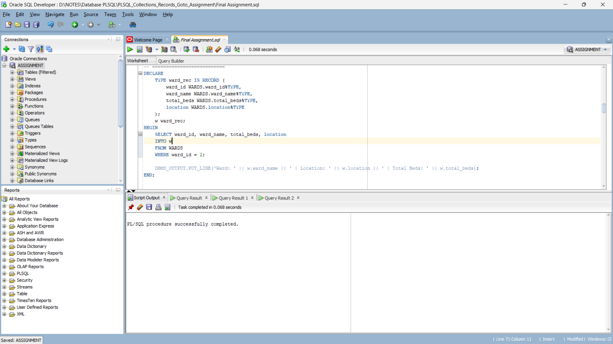
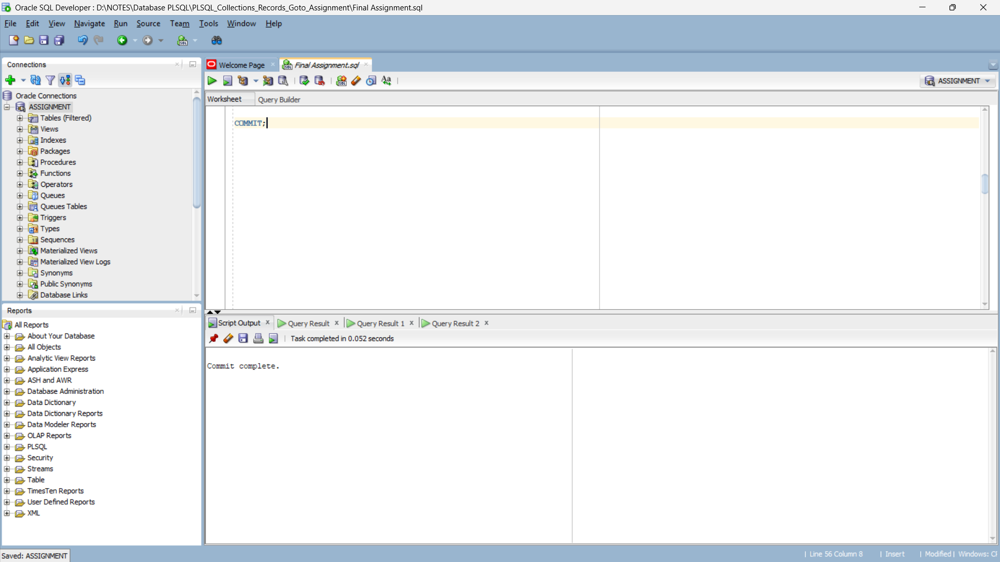

## NAMES: NIYOMWUNGERE Elyse
## ID: 28273
## DEPARTMENT: Software Engineering
## COURSE: DATABASE DEVELOPMENT WITH PL/SQL

# Project Topic: Hospital Bed Availability Tracker 

## Project Summary
This system tracks real-time bed occupancy across hospital wards (General, ICU, Pediatrics).  
It provides alerts when wards reach capacity, supports patient assignment, and demonstrates PL/SQL features (records, collections, triggers, simple procedures). The database schema and example PL/SQL scripts are in `Queries.sql`.

## Author
- Name: NIYOMWUNGERE Elyse 
- Student ID: 28273 
- Course: Database Development with PL/SQL  
- Department: Software Engineering

## Table of Contents
1. Background  
2. Problem Statement  
3. Proposed Solution  
4. Objectives  
5. Project Overview  
6. Features  
7. Database Schema  
8. Files in this Repository  
9. Requirements  
10. Installation & Setup  
11. Running the SQL & PL/SQL scripts  
12. Testing & Expected Outputs  
13. Notes on triggers and PL/SQL examples  
14. Screenshots  
15. Contribution  
16. License  
17. Contact  

---

## 1. Background
Hospitals often face challenges in monitoring the availability of beds across different wards in real time. Traditionally, staff rely on manual records or spreadsheets, which are prone to errors and delays in updates. During emergencies or peak hours, this can result in confusion and inefficiency, potentially delaying patient care.  

With modern database technologies, hospitals can automate data entry, maintain consistency, and generate instant reports on bed utilization and ward occupancy. This project demonstrates how Oracle Database and PL/SQL can be used to build a reliable bed management system.

## 2. Problem Statement
Many hospitals still use manual methods to track patient admissions and bed occupancy. This approach causes several issues:
- Lack of accurate and up-to-date information about available beds.
- Time wasted searching for available space for new patients.
- Risk of over-occupancy or under-utilization of wards.
- Limited ability to generate analytical reports or alerts automatically.

The absence of an automated and integrated system results in inefficiency and delayed decision-making, especially in emergencies.

## 3. Proposed Solution
This project proposes a **database-driven Hospital Bed Availability Tracker** that uses PL/SQL programming features to automatically monitor and update ward occupancy. The solution includes:
- A well-structured relational database with tables for wards, beds, and patients.
- Triggers that alert when a ward reaches full capacity.
- PL/SQL blocks and procedures to manage bed assignments and discharges.
- Reports showing current occupancy, free beds, and patient distribution.

The system will improve efficiency, minimize manual errors, and provide real-time insights into hospital bed availability.

## 4. Objectives
- Design a normalized relational database for hospital bed management.  
- Implement PL/SQL features (records, collections, triggers, loops) for data processing.  
- Demonstrate automation through triggers that detect full wards.  
- Generate real-time reports for decision support.  
- Serve as an educational project illustrating practical PL/SQL usage.

## 5. Project Overview
The Hospital Bed Availability Tracker provides a centralized way to:
- Store ward and bed data.
- Assign patients to beds.
- Monitor occupied vs free beds.
- Alert staff when wards are full.
- Demonstrate advanced PL/SQL constructs and reporting queries.

## 6. Features
- Schema for WARDS, BEDS, and PATIENTS.
- Sample data inserts for wards, beds, and patients.
- PL/SQL code examples:
  - RECORD to fetch single ward details.
  - COLLECTION for listing available beds.
  - GOTO example handling "no beds".
  - TRIGGER to alert when ward becomes full.
- Reporting queries for occupancy and patient lists by ward.

## 7. Database Schema
- **WARDS**: `ward_id (PK)`, `ward_name`, `total_beds`, `location`  
- **BEDS**: `bed_id (PK)`, `ward_id (FK -> WARDS.ward_id)`, `occupied (CHAR)` default 'N', `bed_type`  
- **PATIENTS**: `patient_id (PK)`, `patient_name`, `bed_id (FK -> BEDS.bed_id)`, `admit_date`, `discharge_date`, `condition`

The schema is normalized up to 3.5NF to minimize redundancy and maintain data integrity.

## 8. Files in this Repository
- `Queries.sql` — Full DDL, sample data inserts, PL/SQL examples, triggers, and reports.
- `README_enhanced.md` — This enhanced README (academic version).
- `Screenshots/` — Folder for database and PL/SQL execution outputs.
- (Optional) `images/` — Diagrams and schema visuals.

## 9. Requirements
- Oracle Database (PDB or XE).  
- SQL*Plus or Oracle SQL Developer.  
- User privileges to create tables and triggers.

## 10. Installation & Setup
1. Open SQL*Plus or Oracle SQL Developer and connect to your target PDB:
   ```bash
   sqlplus elyse/elyse123@localhost:1521/XEPDB1'
   ```
2. Run the script:
   ```sql
   "D:\NOTES\Database PLSQL\PLSQL_Collections_Records_Goto_Assignment"
   ```

## 11. Running the SQL & PL/SQL scripts
The script includes:
- Table creation and data insertion.
- PL/SQL blocks demonstrating key concepts.
- Trigger `bed_occupancy_alert` to display an alert when a ward becomes full.

Enable DBMS output in your SQL client to view messages.

## 12. Testing & Expected Outputs
- Verify tables exist using:
   ```sql
   SELECT table_name FROM user_tables;
   ```
- Test ward occupancy report and trigger output as described in the previous version.

## 13. Notes on Triggers and PL/SQL Examples
- Trigger fires **AFTER UPDATE or INSERT** on BEDS.
- It calculates occupied vs total beds and alerts via DBMS_OUTPUT when a ward is full.
- PL/SQL examples demonstrate **records, loops, collections, and exception handling**.

## 14. Screenshots
Include execution screenshots here for better presentation (optional but recommended).
## A. Create Tables
## Image 1

## Image 2

## Image 3

## B. Insert Sample Data
## 1. Insert data into wards table

## 2. Insert data about general into beds table 

## 3. Insert data about ICU into beds table 
1[These commands add three beds to the ICU ward in the BEDS table. All beds are free.](./Images/Insert%20Data%20about%20ICU%20into%20Beds%20Table.png)
## 4. Insert data about general into beds table 

## 5. Insert data into patients table


## C. PL/SQL Record Example

 ##  D. PL/SQL COLLECTION Example

## E. PL/SQL GOTO Example

## F. Trigger for Alerts

## G. Show bed occupancy per ward

## H. Show all patients per ward

## I. Commit

## 15. Contribution
Future enhancements:
- Add user authentication (nurses, doctors, admin).  
- Integrate notification services.  
- Build a web interface connected to this database.

## 16. License
For educational use only. Attribution required when reusing the code.

## 17. Contact
Author: **NIYOMWUNGERE Elyse**  
Student ID: **28273**  
Course: **Database Development with PL/SQL**
Email: **elysepuru@gmail.com**  

---

### Final Submission Checklist
- [ ] Run `Queries.sql` successfully.  
- [ ] Capture PL/SQL execution screenshots.  
- [ ] Add author contact info.  
- [ ] Zip repository for submission.


## References

1. [Freitas, R., & Araújo, C. (2024). The digital transformation applied to bed management in hospitals. Revista de Administração Mackenzie](https://doi.org/10.1590/1678-6971/eramr240099)
 
2. [Damawati, D. N., & Kusumo, M. P. (2023). Bibliometric Analysis of Hospital Bed Management Study. Jurnal Aisyah: Jurnal Ilmu Kesehatan, 8(3).](https://doi.org/10.30604/jika.v8i3.2081)
 
3. [Bartlett, B. N., Vanhoudt, N. N., Wang, H., Anderson, A. A., … & Anil, G. (2023). Optimizing inpatient bed management in a rural community-based hospital: A quality improvement initiative. BMC Health Services Research, 23, 10008.](https://doi.org/10.1186/s12913-023-10008-6)
 
4. [Ren, L., Zhang, X., Wang, J., Sun, M., Tang, S., & Gong, N. (2017, May). Design of Hospital Beds Center Management Information System based on HIS. In 2nd International Conference on Materials Science, Machinery and Energy Engineering (MSMEE 2017) (pp. 1289-1294). Atlantis Press.](https://doi.org/10.2991/msmee-17.2017.242)
 
5. [Shaare, M. N., Zin, M. S. I., Isa, A. A. M., & Salim, S. I. (2024). Optimizing Hospital Bed Management System with IoT. International Journal of Academic Research in Business and Social Sciences, 14(12), 3982-3995.](https://doi.org/10.6007/IJARBSS/v14‐i12/24355)
 
6. [Hadid, M., Padmanabhan, R., Elomri, A., Kerbache, L., El Omri, A., & Aboumarzouk, O. M. (2025, July). Digital Twin Technology for Hospital Bed Management: Data-Driven Comparative Analysis. Proceedings of the 8th European Industrial Engineering and Operations Management Conference. IEOM Society International.](https://doi.org/10.46254/EU08.20250200)
 
7. [Rocheteau, E., Liò, P., & Hyland, S. (2020). Temporal Pointwise Convolutional Networks for Length of Stay Prediction in the Intensive Care Unit. arXiv.](https://arxiv.org/abs/2007.09483)
 
8. [Chowdhury, T. N., Mou, S. A., & Rahman, K. N. (2025). A Hybrid Data-Driven Approach For Analyzing And Predicting Inpatient Length Of Stay In Health Centre. arXiv.](https://arxiv.org/abs/2501.18535)
 
9. [Kern, ? (2023). Managing inpatient bed setup: an action-research approach using lean technical practices and lean social practices. Emerald Publishing.](https://doi.org/10.1108/JHOM-?-?-2022-)?(Note: complete details omitted) 

10. [Wallace, ? (2020). Models and methods for determining the optimal number of beds in hospitals and regions: a systematic scoping review. BMC Health Services Research, 20, 186.](https://doi.org/10.1186/s12913-020-5023-z)

